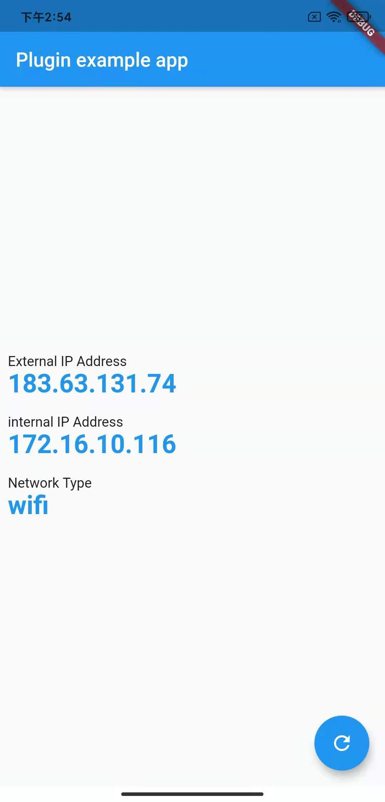

# r_get_ip_v3
- Imp mere clone of r_get_ip to make it flutter 3 compitable
[](https://pub.dartlang.org/packages/r_get_ip)



A new Flutter project about get ip address.

# Supported Platform

- Android
- IOS
- MacOS
- Web
- Windows

# Getting Started

1. Get Internal IP Address.

```dart
RGetIp.internalIP
```

2. Get External IP
```dart
RGetIp.externalIP
```

3. Get Network Type
```dart
RGetIp.networkType
```

## License

```
   Copyright 2021 rhyme_lph

   Licensed under the Apache License, Version 2.0 (the "License");
   you may not use this file except in compliance with the License.
   You may obtain a copy of the License at

       http://www.apache.org/licenses/LICENSE-2.0

   Unless required by applicable law or agreed to in writing, software
   distributed under the License is distributed on an "AS IS" BASIS,
   WITHOUT WARRANTIES OR CONDITIONS OF ANY KIND, either express or implied.
   See the License for the specific language governing permissions and
   limitations under the License.
```
# r_get_ip_v3
